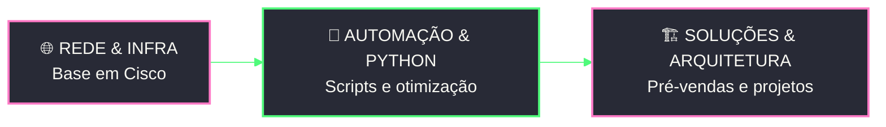

<!-- ===================== HEADER ===================== -->

---

<h2 align="center">👩‍💻 Sobre mim</h2>

Sou estudante de **Ciência da Computação** e **Network Intern**, atuando em **Pré-Vendas** e **Arquitetura de Redes**.

💡 Gosto de **conectar redes, programação e automação** para criar soluções mais **inteligentes** e **eficientes**.

`NETWORKS` ━━ `INFRASTRUCTURE` ━━ `AUTOMATION` ━━ `DEVELOPMENT`

| 🌐 Redes | ❇️ Tecnologia | 📝 Documentação | ⚙️ Automação | 🤖 IA |
| :---: | :---: | :---: | :---: | :---: |
| Arquitetura & Infraestrutura | Futuro | Técnica | Processos | Aplicada à TI |

<h2 align="center">🚀 Atualmente</h2>

**Estagiária de Redes — Pré-Vendas | Arquitetura de Redes**

Atuo com arquitetura de redes, documentação técnica e soluções de infraestrutura, enquanto desenvolvo conhecimento prático em redes e tecnologia.

📚 **Estudando:**

  
  
  
  
  
  

<h2 align="center">🛠️ Skills & Tecnologias</h2>

  
  
  
  
  
  
  

<h2 align="center">📊 GitHub Analytics</h2>

<h2 align="center">📁 Projetos</h2>

| Projeto | Tecnologia | Descrição | Nível |
| :---: | :---: | :---: | :---: |
|  |  | Biblioteca simples voltada para organização e gerenciamento de acervo. |  |
|  |   | 🚧 Em desenvolvimento: otimização e automação de rotinas de serviço. |  |

<h2 align="center">🏆 Certificações</h2>

| | | |
| :---: | :---: | :---: |
|  **Introduction to Networks** Cisco Networking Academy |  **Switching, Routing & Wireless Essentials** Cisco Networking Academy |  **Enterprise Networking, Security & Automation** Cisco Networking Academy |
|  **Introduction to Cybersecurity** Cisco Networking Academy | | |

<h2 align="center">🗺️ Roadmap</h2>

**✅ Concluído**

✔️ **Fundamentos de Redes** — arquitetura e protocolos 
✔️ **Trilha CCNA** — Cisco Networking Academy (ITN, SRWE, ENSA) 
✔️ **Introduction to Cybersecurity** — Cisco Networking Academy 
✔️ **Fundamentos de Automação** — scripts em Python para TI

**🔜 Em andamento & próximos passos**

⬜ **Exame oficial Cisco CCNA** _(em preparação)_ 
⬜ **Automação de Redes** com Python 
⬜ **Aprofundamento** em infraestrutura e programação 
⬜ **Projetos práticos** de IA aplicada à TI e redes

---

**📫Conecte-se Comigo!**

